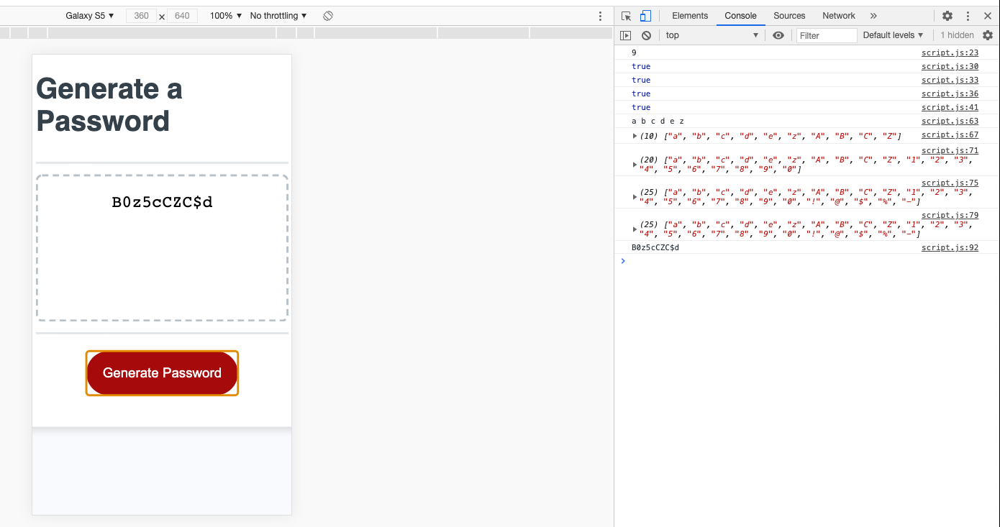
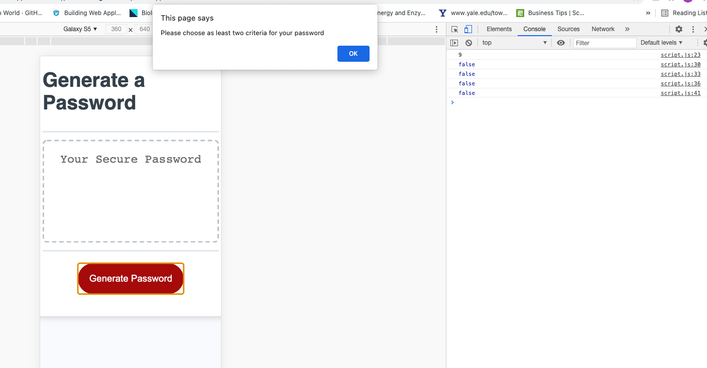
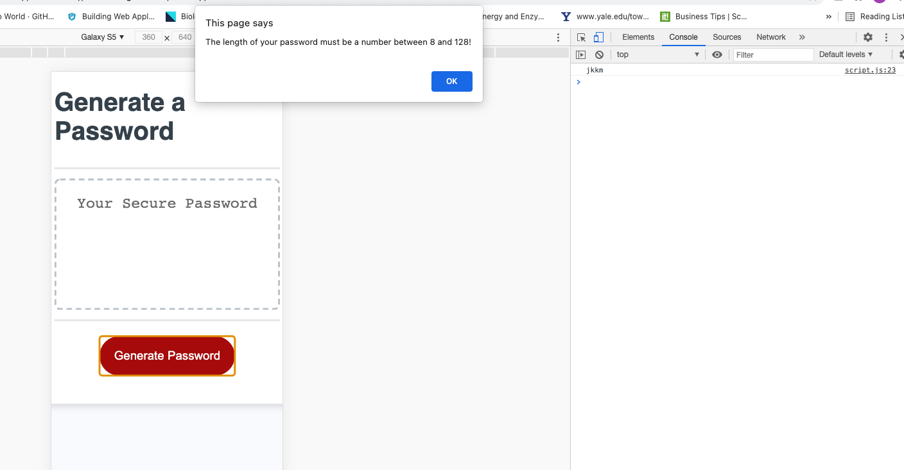
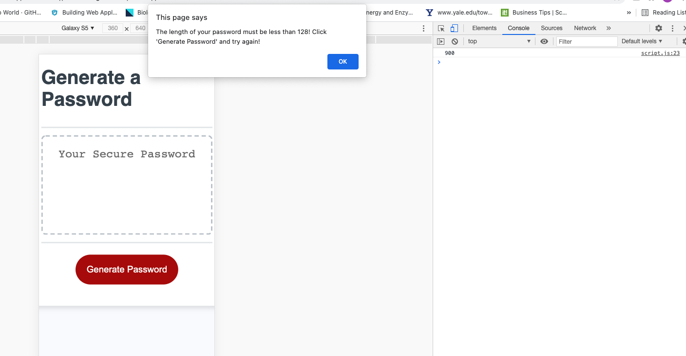

# 03 JavaScript: Password Generator

## Description & Solution

This application generates a complex password, based on the confirmations that the user gives to the following questions:

- How long the password is - the user will need to choose a password between 8 to 128 Characters.
  For this a pre-check is done to check if:

  1.  the entered value is a number
  2.  if not a number alert the user and ask to insert a number
  3.  if a number, convert it to int and check is 8<=number<=128. If the number is < 8 or >128 alert the user to enter a number within this boundaries.
  4.  if the number is within [8, 128] ask the the following questions to the user:

- Does the user want lowercase characters?
  > the `confirm()` function is used to capture user's reply for this.
- Does the user want uppercase characters?
  > the `confirm()` function is used to capture user's reply for this.
- Does the user want numbers?
  > the `confirm()` function is used to capture user's reply for this.
- Does the user want special characters?
  > the `confirm()` function is used to capture user's reply for this.

In case none of the questions is confirmed the user will be alerted to at least enter a confirmation for the above questions (line 44)

Next a combined array [combinedArray] will be generated based on the confirmation given for each question. The confirmation is of type boolean and it is easy to use it in a if statement.

In the next step a random array will be generated using the result from the combinedArray
with the length chosen from the user. For this a for loop is used (line 81)

The created array will be stored in the passwordArray and converted to string (line90) and the returned value will be stored in the var password, which is returned at the end of the generateFunction() to be used in the write function so to update the textbox with the generated value
(line 103)

## Screenshots

Case 1: The user confirms all the questions and the password is generated successfully

Case 2: The user does not confirm any of the questions. He/she is alerted and asked to a

Case 3: The user enters a character not a number

Case 4: The user enters a number greater than 128

## Review

- The URL of the deployed application: https://github.com/vilmaq/password-generator

- The URL of the GitHub repository: https://vilmaq.github.io/password-generator/
